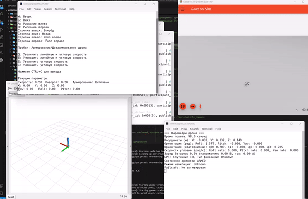

# Aerial Drone Control with ROS 2 and PX4

This project provides a ROS 2 interface for controlling a drone using the PX4 autopilot in offboard mode. It includes nodes for keyboard control, offboard control, visualization, and more. The setup is primarily designed for simulation with PX4 SITL (Software In The Loop) and can be extended for use with real drones.



The project was inspired by the following sources:
- [px4-offboard by Jaeyoung Lim](https://github.com/Jaeyoung-Lim/px4-offboard)
- [ROS2 PX4 Offboard Example by ARK Electronics](https://github.com/ARK-Electronics/ROS2_PX4_Offboard_Example)

## Installation

## Installation

1. **Clone the Repository**:
   ```bash
   git clone https://github.com/AntonSHBK/dron_px4_ros2_docker
   cd dron_px4_ros2_docker/docker

   docker-compose up --build
   ```

2. **Build the Workspace**:
   ```bash
   colcon build --packages-select px4_msgs px4_ros_com
   colcon build --packages-select aerial_drone_base
   ```

3. **Source the Workspace**:
   ```bash
   source install/setup.bash
   ```

## Launching the Drone

### Start the ROS 2 Nodes

Launch the ROS 2 nodes required for controlling the drone:
```bash
ros2 launch aerial_drone_base aerial_drone_base.py
```

Run a script to collect data from a drone 
```bash
ros2 run aerial_drone_base data_save.py
```

This launch file will start the following nodes:
- **processes_node**: Manages different background processes such as the PX4 SITL simulation.
- **control_node**: Handles the offboard control and sends commands to PX4.
- **velocity_node**: Manages the drone's velocity commands.
- **visualizer_node**: Provides visualization tools for Rviz.

## Keyboard Controls

Use the following keys to control the drone:

- **W**: Move Up
- **S**: Move Down
- **A**: Yaw Left
- **D**: Yaw Right
- **Up Arrow**: Pitch Forward
- **Down Arrow**: Pitch Backward
- **Left Arrow**: Roll Left
- **Right Arrow**: Roll Right

### Speed Adjustments:
- **Q**: Increase linear and angular speed
- **Z**: Decrease linear and angular speed
- **E**: Increase angular speed only
- **C**: Decrease angular speed only

### Arm/Disarm:
- **Space**: Arm or disarm the drone

### Exit:
- **CTRL+C**: Exit the teleop node

## Troubleshooting

- If the drone doesn't respond to commands, ensure that the PX4 is running properly and that the nodes are correctly launched.
- Check the ROS 2 topics to ensure messages are being published correctly:
  ```bash
  ros2 topic list
  ```
- Monitor logs for any errors or warnings.

## Additional Information

It's important to ensure that the PX4 versions are consistent across all components of your system. When working with px4_msgs and px4_ros_com, it's essential to use the same version as the PX4 firmware, such as 1.14. Mismatched versions can lead to compatibility issues, affecting communication between the ROS 2 nodes and the PX4 autopilot. Make sure to check out the correct branches or tags in the repositories to align with your PX4 firmware version.

- **PX4 Documentation**: [https://docs.px4.io/](https://docs.px4.io/)
- **ROS 2 Documentation**: [https://docs.ros.org/en/humble/](https://docs.ros.org/en/humble/)

## License

This project is licensed under the MIT License. See the [LICENSE](LICENSE) file for more details.